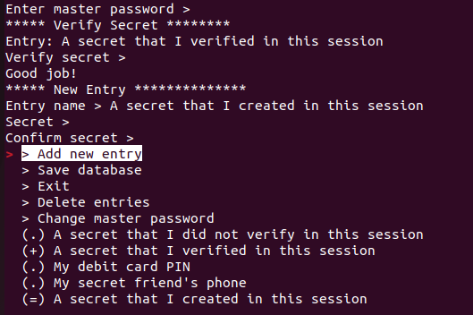

# PwdRecall
PwdRecall is a simple linux tool for enhancing memory retention of sensitive data. Secrets are stored as argon2d hashes and the whole database is encrypted with AES-256.

## Installation and execution
1. **Download the Script**: Obtain the `pwdrecall.py` script and save it to your desired local directory.
2. **Grant Execution Permissions**: Navigate to the directory containing the script in your terminal, then execute the command `chmod +x pwdrecall.py`.
3. **Run the Script**: Execute the scipt by typing `./pwdrecall.py`.

## Usage

Upon the initial execution of the script, you will be prompted to set a master password. This password is utilized to encrypt the vault (file `pwdrecall.vault`) using AES-256 encryption. You have the option to modify this password at a later stage. Note that each time the script is run, the master password is required to decrypt the vault.

Once the master password is entered, a menu will be displayed containing various actions and a list of stored secret names within the vault (if any). Navigate through the menu to select your desired action.

If you select a secret name, you will be prompted to input the secret to verify your knowledge of it. Feedback will indicate whether the secret was entered correctly. Successfully verified secrets will be displayed in the menu with a `(+)` prefix.

Additionally, the menu provides the following options:
1. **Add new entry**: Input the name and value (twice for verification) of a new secret to add it to the session database. Remember to save the database afterward.
2. **Save database**: Save the current session database to `pwdrecall.vault`.
3. **Exit**: Terminate the script. Remember to save the database if any changes were made.
4. **Delete entries**: Select entries to delete from the session database.
5. **Change master password**: Input a new master password. Save the database for this change to take effect in `pwdrecall.vault`.

